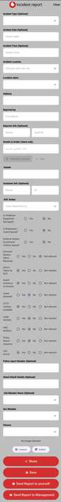

<p align="center">
  
</p>

<h1 align="center">IRG — Incident Report Generator</h1>

<p align="center"><strong>Field Security Reporting Platform for Vodafone Egypt</strong></p>

<p align="center">
  
  
  
  
  
</p>

---

## Overview

**IRG** is an internal mobile application built for Vodafone Egypt's **Security Operations Center (SOC)** team. It replaces a manual, paper-based workflow with a fully digital process — from capturing incident details on-site to generating a ready-to-share Word report — all from a single mobile device.

> **This is a private, proprietary application built exclusively for Vodafone internal operations. Source code is not publicly available.**

---

## The Problem It Solves

Before IRG, the SOC team relied on a **manual, multi-step process** to document and report security incidents:

| Step | Manual Process | With IRG |
|------|---------------|----------|
| Fill incident details | Manually type into a Word document on a PC | Fill a guided mobile form with smart dropdowns |
| Arabic details | Write separately, translate manually | Type in Arabic → auto-translated to English in one tap |
| Attach evidence | Screenshot, paste into Word | Capture or select photo directly in-app |
| Generate report | Format manually, save file | Auto-generated formatted `.docx` in one tap |
| Distribute report | Open email client, attach file, compose email | One-tap send to management or share via any app |

**Result:** Reporting time reduced from **~30–45 minutes** of manual work to **under 5 minutes** from incident capture to report delivery.

---

## Key Features

### Incident Data Capture
- Select **incident type** from a managed dropdown (Theft, Intrusion, Vandalism, etc.)
- Pick **incident date & time** from native pickers
- Choose **location type and location name** from dynamically loaded hierarchical lists (Office, Tower, Truck, Retail, etc.)
- Enter **reporter information** (name, staff ID) and optional **customer details**

### Smart Text & Translation
- Enter incident **details in Arabic** and translate to English automatically with one tap
- Bilingual workflow: Arabic text used for sharing (WhatsApp/Teams), English text used in the formal report

### Security Assessment Checklist
A comprehensive **Yes / No / Not Relevant** questionnaire covering:
- Vodafone equipment damage
- Employee / guard / vendor injuries
- Intrusion alarm status
- SOC action taken
- Guard existence & whether guard was attacked
- CCTV availability
- Legal & H&S notification
- Police report issuance
- LEA (Law Enforcement Agency) involvement

### Evidence Attachment
- Capture a photo directly with the **device camera**
- Or pick an existing image from the **gallery**
- Image is embedded automatically into the exported document

### Report Distribution

| Action | Description |
|--------|-------------|
| **Share** | Share incident summary (in Arabic) via WhatsApp, Teams, or any installed app |
| **Save** | Export a formatted `.docx` report locally to the device |
| **Send to Yourself** | Email the full report (with image) to the logged-in SOC member |
| **Send to Management** | Email the full report (with image) to the security management distribution list |

### Dynamic Configuration via Firebase
- All dropdown data (locations, SOC team members, LEA members, closure statuses, action items) is managed remotely via **Firebase Remote Config**
- No app update required to add new locations or team members — changes propagate instantly

---

## Architecture

IRG follows **Clean Architecture** principles with a clear separation of concerns across three layers, combined with the **BLoC** pattern for predictable state management.

```
┌─────────────────────────────────────────────┐
│              Presentation Layer              │
│  ┌──────────────┐   ┌──────────────────────┐│
│  │  UI Widgets  │◄──│  BLoC (Events/State) ││
│  │  (Screens)   │   │  IncidentBloc        ││
│  └──────────────┘   └──────────────────────┘│
└────────────────────┬────────────────────────┘
                     │ uses
┌────────────────────▼────────────────────────┐
│               Domain Layer                  │
│  ┌─────────────────────────────────────────┐│
│  │  Repository Interface (IncidentRepo)    ││
│  │  Business Logic / Use Cases             ││
│  └─────────────────────────────────────────┘│
└────────────────────┬────────────────────────┘
                     │ implements
┌────────────────────▼────────────────────────┐
│                Data Layer                   │
│  ┌───────────────┐   ┌─────────────────────┐│
│  │ Local Source  │   │   Remote Source     ││
│  │ (SQLite DB)   │   │ (Firebase Remote    ││
│  │               │   │    Config)          ││
│  └───────────────┘   └─────────────────────┘│
└─────────────────────────────────────────────┘
```

### Data Flow

```
User Action
    │
    ▼
IncidentBloc (receives Event)
    │
    ▼
IncidentRepository (domain contract)
    │
    ├──► LocalDataSource (SQLite) ──► lookup tables, location hierarchy
    │
    └──► Firebase Remote Config ──► dynamic team/location lists
    │
    ▼
New State emitted ──► UI rebuilds
```

### Report Generation Flow

```
Form Submitted
    │
    ▼
ExportDocumentEvent / SendReportEvent
    │
    ▼
Fill .docx template with form data + image
    │
    ├──► Save to device storage      (Save)
    ├──► Email via email sender      (Send to Yourself / Send to Management)
    └──► Share via share_plus        (Share)
```

---

## Tech Stack

| Category | Technology |
|----------|------------|
| Framework | Flutter (Dart) |
| State Management | flutter_bloc (BLoC pattern) |
| Architecture | Clean Architecture |
| Local Database | sqflite (SQLite) |
| Remote Config | Firebase Remote Config |
| Document Generation | docx_template |
| Email | flutter_email_sender |
| Sharing | share_plus |
| Image Handling | image_picker |
| Translation | HTTP API |
| DI Container | get_it |
| Functional Programming | dartz |

---

## Screenshots

### Incident Report Form

> Complete form — incident type, date/time, location, reporter info, Arabic-to-English translation, security checklist, image attachment, and action buttons.

<p align="center">
  
</p>

### Generated Report (Word Document)

> Auto-generated `.docx` report populated with all form data and the attached incident image.

<p align="center">
  
</p>

---

## Impact

- Eliminates manual report writing and formatting
- Reduces incident reporting time from **~30–45 min → under 5 min**
- Ensures **consistent, standardized** report format across all SOC members
- Enables **instant distribution** to management directly from the field
- Supports **bilingual operations** (Arabic/English) with built-in translation
- Lookup data is **centrally managed** via Firebase — no app update needed for operational changes

---

<p align="center">
  <sub>Internal tool — Vodafone Egypt Security Operations Center &nbsp;|&nbsp; Not for public distribution</sub>
</p>
# IRG-DOC
